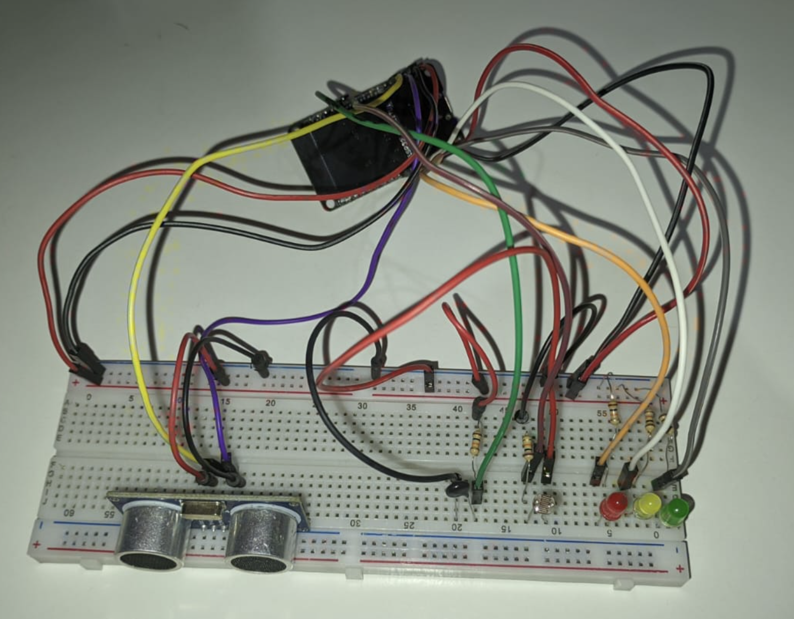
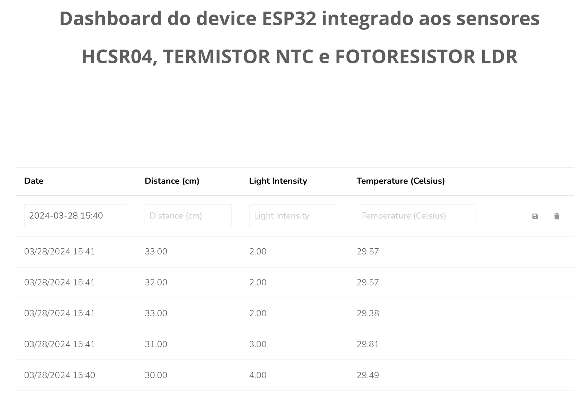
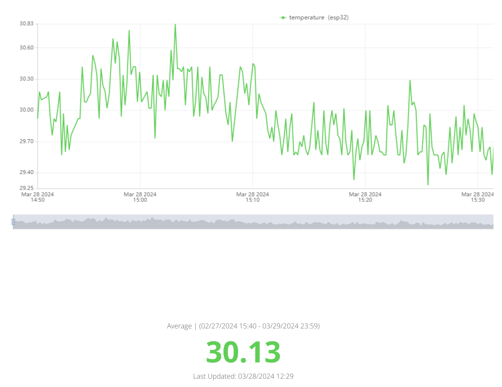

# Sistema de Segurança Residencial Inteligente (SSRI)

> _OBS.: Repositório para NACs I e II da disciplina IoT, ministrada pelo professor André Godoi, FIAP (2024)._

## Descrição

Este projeto tem como objetivo desenvolver um Sistema de Segurança Residencial Inteligente (SSRI) utilizando o microcontrolador ESP32. 

O sistema é projetado para detectar e monitorar movimentos em áreas específicas da casa, identificar possíveis incêndios ou variações anormais na temperatura ambiente e indicar a presença ou ausência de luz em determinados locais. O SSRI é composto por três principais sensores: um sensor ultrassônico (HC-SR04) para detectar movimentos, um sensor de temperatura (Termistor NTC) para identificar variações de temperatura e um fotoresistor (LDR) para medir a intensidade da luz.

Os dados coletados pelos sensores são enviados para a plataforma Ubidots, onde podem ser monitorados e analisados em tempo real. Além disso, o sistema utiliza LEDs para indicar possíveis anormalidades nos valores medidos pelos sensores, facilitando a identificação de eventos suspeitos.

## Funcionamento do projeto

1. **Configuração inicial**: no início, o código realiza a configuração inicial, incluindo a conexão com a rede Wi-Fi e a inicialização dos pinos dos LEDs utilizados para indicar anormalidades nos sensores.

2. **Loop principal**:
   - **Conexão com Ubidots**: verifica se o dispositivo está conectado à plataforma Ubidots e, caso contrário, tenta reconectar.
   
   - **Coleta de dados**: a cada ciclo do loop, os sensores são consultados para obter as seguintes informações:
     - Distância medida pelo sensor ultrassônico (HC-SR04).
     - Temperatura medida pelo sensor de temperatura (Termistor NTC).
     - Intensidade de luz mensurada pelo fotoresistor (LDR).
     
   - **Envio de dados para Ubidots**: os dados coletados são enviados para a plataforma Ubidots para monitoramento em tempo real.
   
   - **Atualização dos LEDs**: com base nos valores medidos pelos sensores, os LEDs são acionados para indicar possíveis anormalidades:
     - LED verde é ligado se a distância medida pelo sensor ultrassônico for menor que 10 cm, indicando possível presença detectada.
     - LED amarelo é ligado se a temperatura medida for superior a 40°C, indicando possível risco de incêndio.
     - LED vermelho é ligado se a intensidade de luz medida for superior a 60%, indicando possível presença de luz ligada (invasão indevida).
     
   - **Exibição de dados no monitor serial**: os dados medidos pelos sensores são exibidos no monitor serial para fins de depuração e monitoramento.

3. **Manutenção da Conexão e Pausa**: A função `ubidots.loop()` é chamada para manter a conexão ativa com a plataforma Ubidots. Após cada ciclo do loop, há uma pausa de 1 segundo (`delay(1000)`) antes do próximo ciclo.

Essa sequência de operações se repete continuamente enquanto o dispositivo estiver ligado, garantindo o monitoramento constante do ambiente residencial e a detecção de possíveis situações de risco.

## Integrantes

| Integrante                  | RM      |
|-----------------------------|---------|
| Gabriel Boragina Fazani     | RM84447 |
| Leandro de Jesus Luna       | RM86492 |
| Marcos Moura dos Santos     | RM86507 |